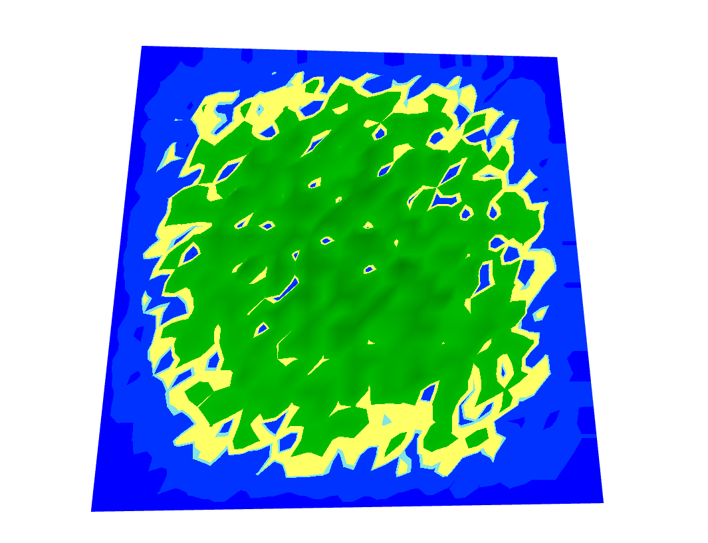

# How to use

# Generate with noise

```import { generate } from "tguesdon-island-generator"```

Generate returns a 2 dimensionnal array of points with x and y position normalized in [0, 1], and elevation normalized in [0, 1].

```const island = generate(width, height, ?intensity, ?attenuation_type);```

 - width, height: number of points that must be generated.
 - itensity: (optional) number which multiply noise ( default to 1 ). Should be between 0 and 1.
 - attenuation_type: (optional) Function used to transform noise into an island. Must be "gate" or "sin" ( default to "sin" ).


Points in the center will have higher elevation than points on the outside.

This package does NOT furnish any way of rendering the island.

Here is an example of render with React Three Fiber :



# Generate with Wave Function Collapse

```import { generateWCFIsland } from "tguesdon-island-generator"```

generateWCFIslland returns a 2 dimensionnal array of points with x and y position normalized in [0, 1], and elevation normalized in [0, 1].

```const island = generateWCFIsland(width, height, allowedStep, ?possibleElevation);```

 - width, height: number of points that must be generated.
 - allowedStep: step allowed between two tiles, must be in [0, 1]. 
 - possibleElevation: (optional) list of possible elevation for points. Default to [0, 0.2, 0.4, 0.6, 0.8, 1.0]. You can put multiple times one elevation to make it happens more. I would advice to stay in [0, 1].
